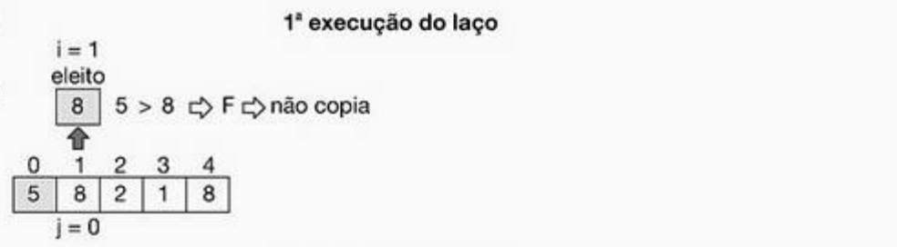
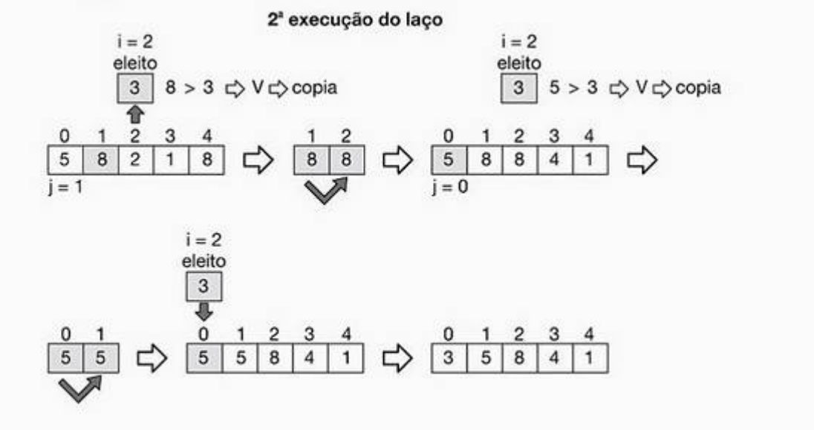
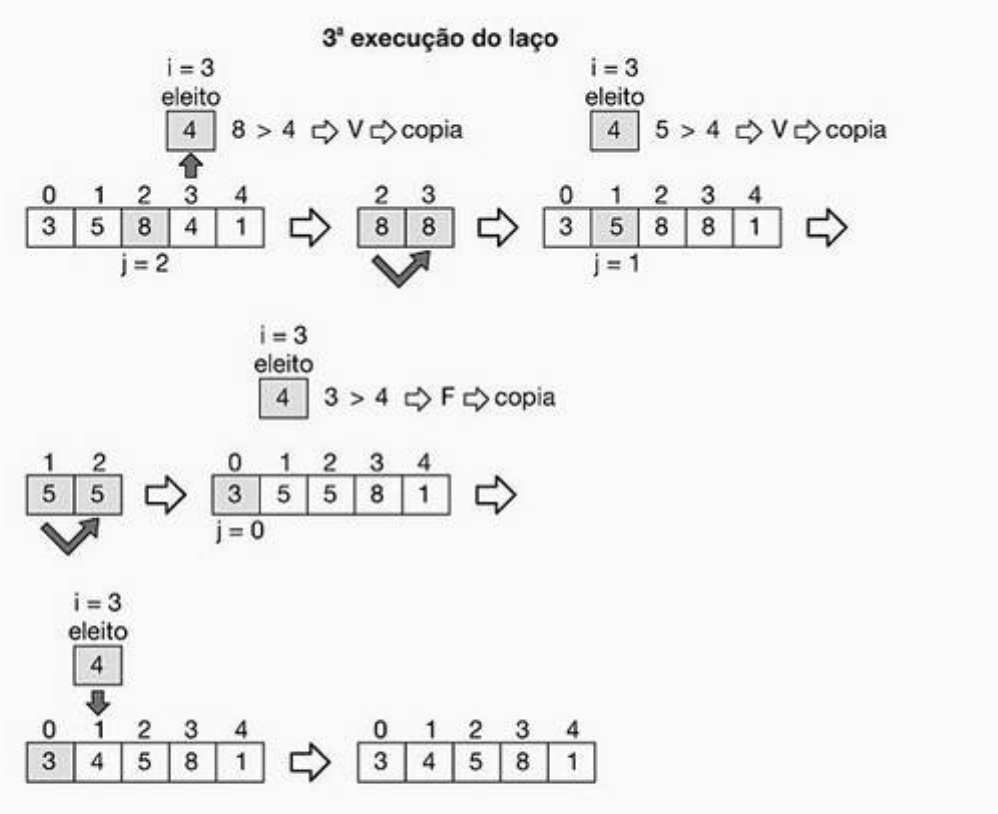
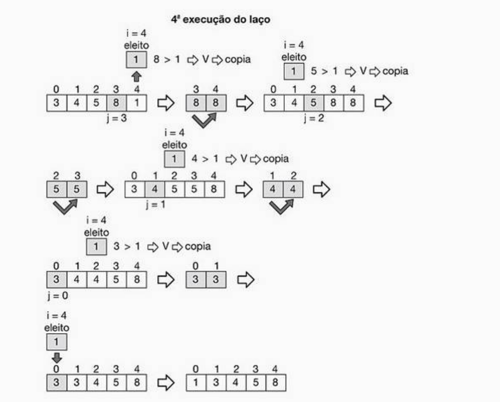

# Quick Sort - Algoritmo de ordenação rápida

Neste algoritmos de ordenação, será "eleito" o segundo maior numero do array para inciar o ciclo de comparações. Desta forma, os elementos à esquerda do eleito estão sempre ordenados de forma crescente ou decrecente. 

```pseudocode
inicio_algoritmo
declaro X[N], i, j,eleito
para i <- 1 até N-1 faz
    inicio
        eleito <- X[i]
        j <- i - 1
        enquanto (j >= 0 e X[j] > eleito )
            inicio
                X[j+1] <- X[j]
                j <- j - 1
            fim
            X[j+1] <- eleito
        fim
    fim
fim_algoritmo
```

As ilustrações seguintes demonstram a execução do algoritmo **Merge Sort** para uma ordenação crescente de um array com __5__ elementos.

1. 1ª Execução


1. 2ª Execução


1. 3ª Execução


1. 4ª Execução



