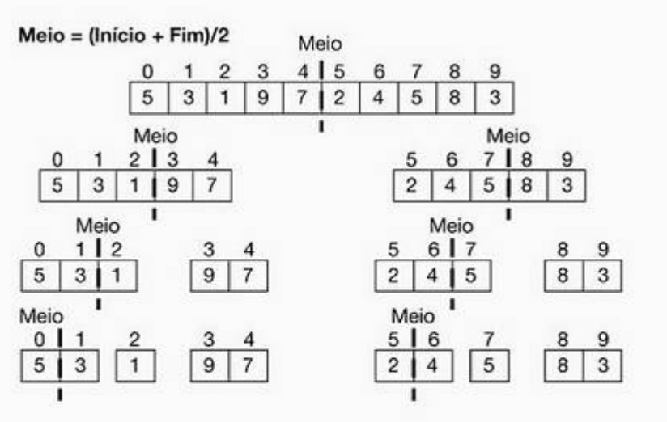
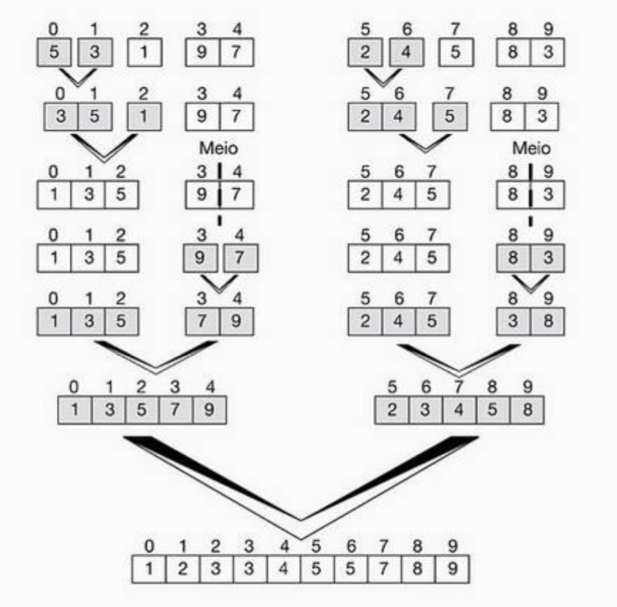

# Merge Sort - Algoritmo de ordenação por intercalação

Neste algoritmos de ordenação, o array é dividido em arrays com metade do tamanho do original, esta operação é efectuada por procedimento recursivo e termina quando o array fique só com um elemento e todos os outros pequenos arrays estejam ordenado e intercalados.
Neste algoritmo, será aplicada a tecnica da divisão e conquista, uma tecnica recursiva que envolve três passos em cada nível de recursão:

1. **Dividir**: dividir o array de **n** elementos a serem ordenados em dois arrays de **n/2* elementos cada um.
1. **Conquistar**: ordenar os dois arrays recursivamente utilizando a ordenação por intercalação.
1. **Combinar**: intercalar os dois arrays ordenados para produzir uma unica solução.


```pseudocode

Função Intercalar(X,inicio,fim, meio)
inicio
declaro poslivre,inicio_array1, inicio_array2, i, auxArray[N]
inicio_array1 <- inicio
inicio_array2 <- meio+1
poslivre <- inicio
enquanto (inicio_array1 <= meio e inicio_array2 <= fim)
    inicio
        se(X[inicio_array1] <= X[inicio_array2])
        entao inicio
            aux[poslivre] <- X[inicio_array1]
            inicio_array1 <- inicio_array1+1
        fim
        senao inicio
            aux[poslivre] <- X[inicio_array2]
            inicio_array2 <- inicio_array2+1
            
        fim
        // Se ainda existir elementos no primeiro array
        // que ainda não foram intercalados
        para i <- inicio_array1 até fim faz
        inicio
            aux[poslivre] <- X[i]
            poslivre <- poslivre+1
        fim
        // Se ainda existir elementos no segundo array
        // que ainda não foram intercalados
        para i <- inicio_array2 até fim faz
        inicio
            aux[poslivre] <- X[i]
            poslivre <- poslivre+1
        fim
        para i <- inicio até fim faz
        inicio
            X[i] <- aux[i]
        fim
fim_função_intercalar
```

```pseudocode

Função merge(X, inicio,fim)
declaro meio como valor numerico  
inicio
    se (inicio < fim)
    entao inicio
        meio <- parteinteira((inicio+fim)/2)
        merge(X,inicio,meio)
        merge(X,meio+1,fim)
        internala(X,inicio,fim,meio)
    fim
fim
fim_funcao_merge
```
```pseudocode

inicio_algoritmo
    declaro X[N] // N é o numero de elementos de estão armazenados
    merge(X,0,N)
fim_algoritmo
```
As ilustrações seguintes demonstram a execução do algoritmo **Merge Sort** para uma ordenação crescente de um array com __5__ elementos.

1. Funçao Merge


1. Funçao Intercalar



