# Quick Sort - Algoritmo de ordenação rápida

Neste algoritmos de ordenação, o array é dividido ao meio por um procedimento recursivo. Esta operação ocorre até o que o array fique apenas com um elemento. O ordenamento dos arrays é fectuado usando a tecncia de particionamento. 
Este algoritmo usa tamenm a tecnica de divisão e conquista visto no algoritmo **Bubble Sort**.
O algoritmo funciona da seguinte forma:

1. **Dividir**: o array **X[p..r]** é "partido" em dois sub-arrays não vazios **X[p..q]** e **X[q+1..r]**, tais que cada elemento de **X[p..q]** é menor ou igual a cada elemento de  **X[q+1..r]**. O indice **q** é calculado neste processo da seguinte forma: escolhe-se um elemento que se encontra na metado do array original, da-se o nome de __pivô__, e rearranjam-se os elementos do array de forma que os ficarem à esquerda de **q** são menores ou iguais ao __pivô__ e os que ficarem à dreita de **q** são maiores ou iguais ao __pivô__.
1. **Conquistar**: os dois sub-arrays são ordenados **X[p..q]** e **X[q+1..r]** por chamadas recursivas ao algoritmos **Quick Sort**.
1. **Combinar**: durante o processo recursivo, os elementos são ordenado no proprio array.


```pseudocode

Função particao(X,p,r)
inicio
declaro pivo,i,j
pivo <- X[(p+r)/2]
i <- p-1
j <- r+1
enquanto (i < j) faz
    inicio
        repeta
            j <- j-1
        até (X[j] <= pivo)
        repeta
            i <- j+1
        até (X[i] >= pivo)
        entao troca(X,i,j)
    fim
retorn j
fim_função_particao
```

```pseudocode

Função troca(X,i,j)
inicio
declaro aux
aux <- X[i]
X[i] <- X[j]
X[j] <- aux

fim_função_troca
```

```pseudocode

Função quickSort(X,p,r)
inicio
declaro q
se (p < r)
entao inicio
    q <- particao(X,p,r)
    quickSort(X,p,q)
    quickSort(X,q+1,r)
fim
fim_função_quickSort
```

```.java

import java.util.*;

public class QuickSort
{

    public static void main(String [] args)
    {
        int [] X = new int[9];
        int indiceDoArray;
        Scanner sc = new Scanner(System.in);
        
        //obter os numeros para introduzir no array/vector
        for(int i=0;i<=9;i++)
        {
            X[i] = sc.nextInt();
        }
        
        // ordenar o array em forma crescente
        quicksort(X,0,9);
        
        //Mostrar os elementos do array ordenados em forma crescente
        for(int i = 0; i<=4; i++)
        {
        System.out.println((i+1) + "º numero: " + X[i]);
        }
    }
    
    public static void quicksort(int X[i], int p, int r)
    {
        int q;
        if(p<r)
        {
            q = particao(X,p,r);
            quicksort(X,p,q);
            quicksort(X,q+1,r);
        }
    }
    
    public static int particao(int X[], int p, int r)
    {
        int pivo, i, j;
        pivo = X[(p+r)/2];
        i = p-1;
        j = r+1;
        
        while(i<j)
        {
            do
            {
                j = j - 1;
            }while(X[j] > pivo);
            
            do
            {
                i = i + 1;
            }while(X[i]< pivo);
            
            if(i<j)
            {
                troca(X,i,j);
            }
        }
        return j;
    }
    
    public static void troca(X,int p, int r)
    {
        int aux;
        aux = X[i];
        X[i] = X[j];
        X[j] = X[i];
    }

}

```


As ilustrações seguintes demonstram a execução do algoritmo **Merge Sort** para uma ordenação crescente de um array com __5__ elementos.

1. 1ª Execução
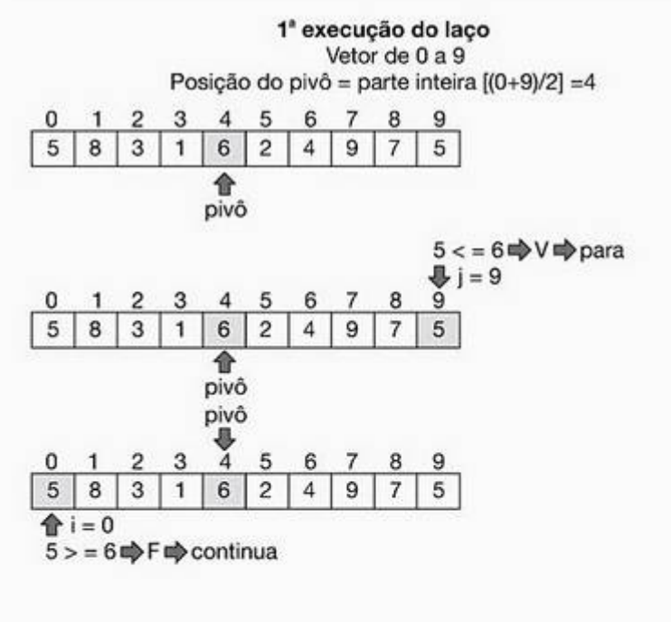


1. 2ª Execução
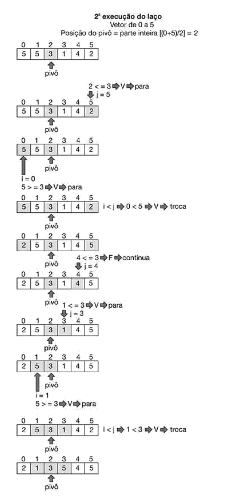

1. 3ª Execução
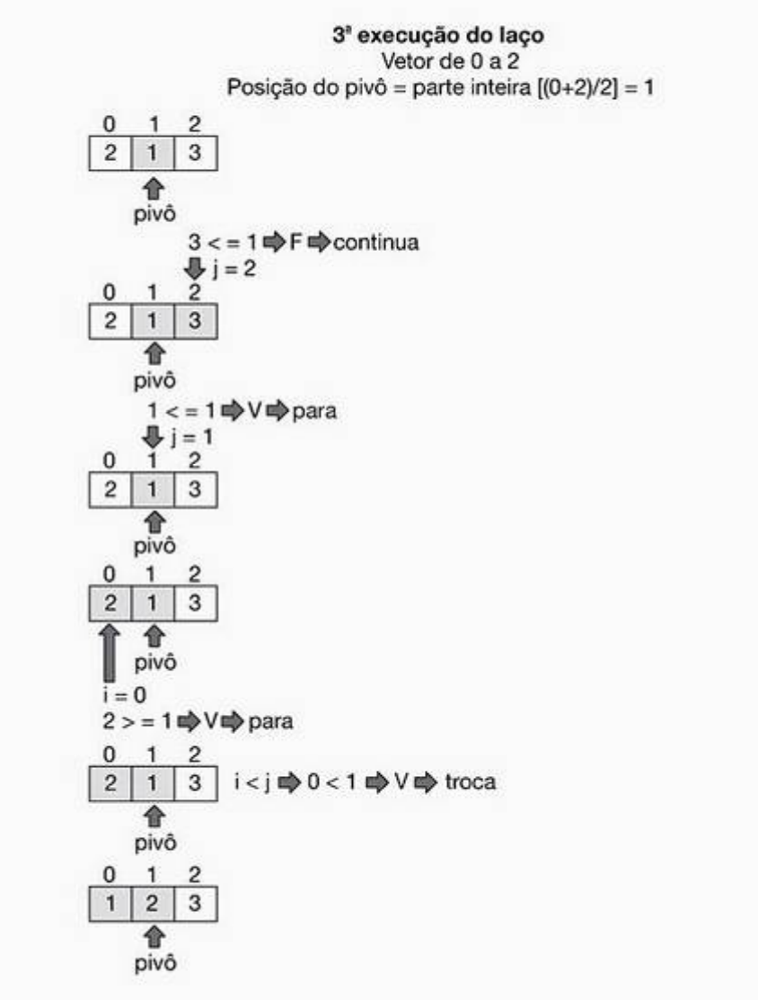

1. 4ª Execução
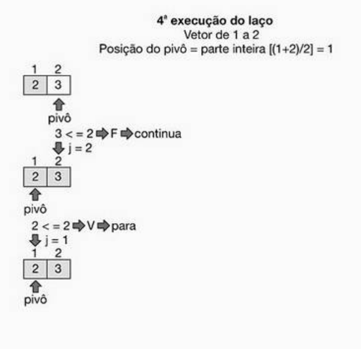
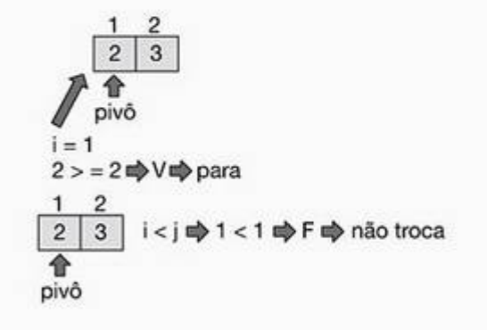

1. 5ª Execução
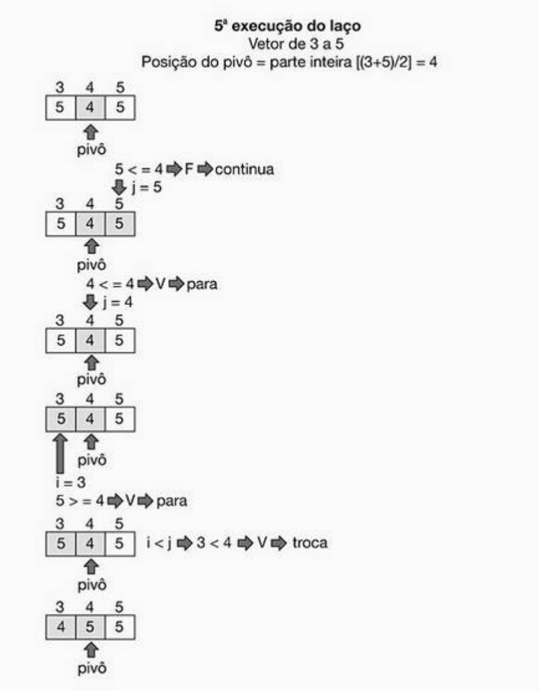

1. 6ª Execução
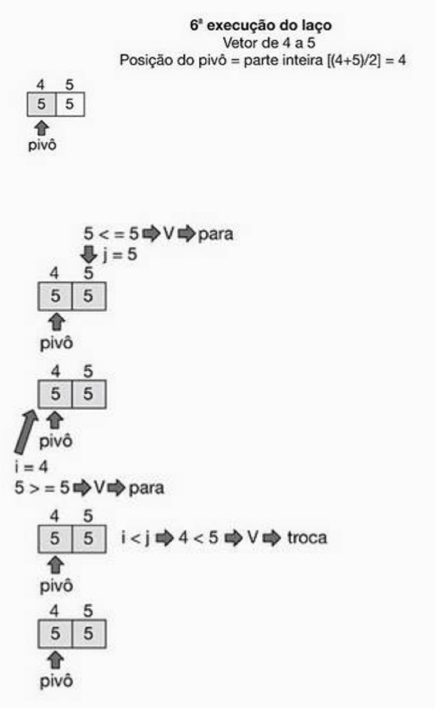

1. 7ª Execução
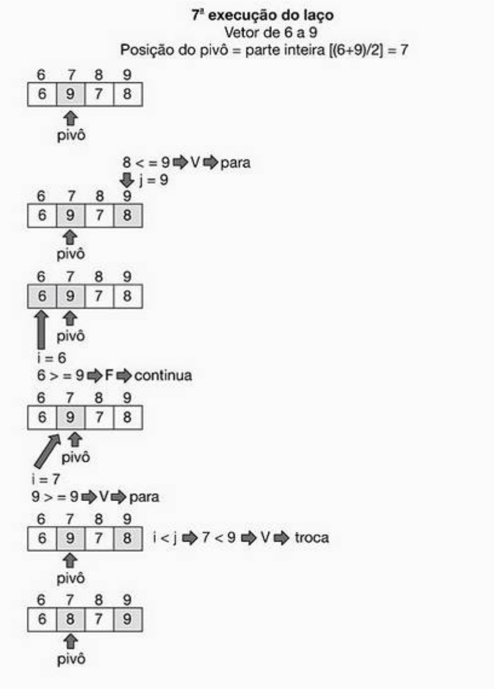

1. 8ª Execução
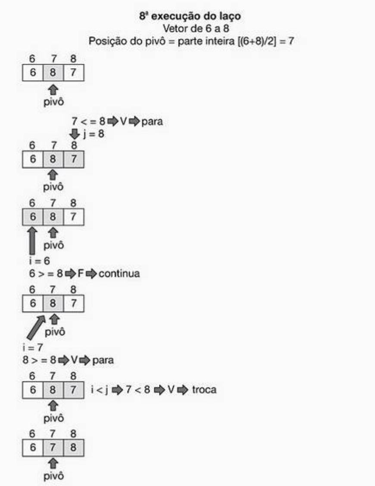

1. 9ª Execução
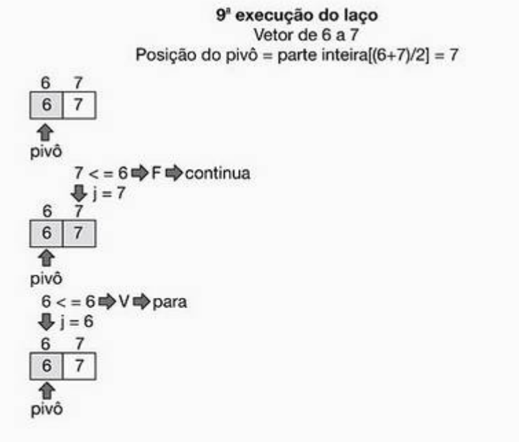
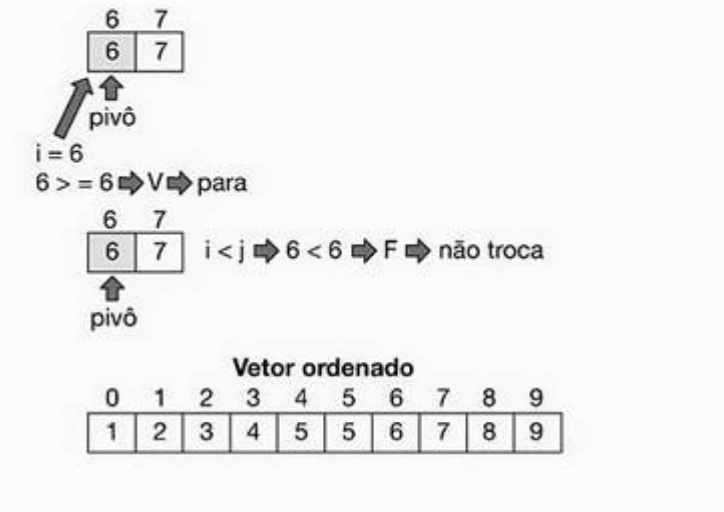


