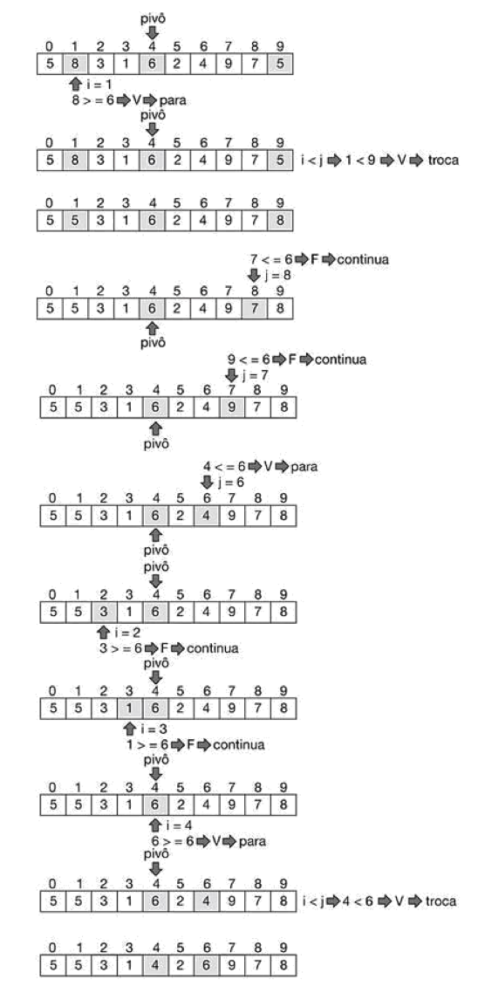

# Quick Sort - Algoritmo de ordenação rápida

Neste algoritmos de ordenação, o array é dividido ao meio por um procedimento recursivo. Esta operação ocorre até o que o array fique apenas com um elemento. O ordenamento dos arrays é fectuado usando a tecncia de particionamento. 
Este algoritmo usa tamenm a tecnica de divisão e conquista visto no algoritmo **Bubble Sort**.
O algoritmo funciona da seguinte forma:

1. **Dividir**: o array **X[p..r]** é "partido" em dois sub-arrays não vazios **X[p..q]** e **X[q+1..r]**, tais que cada elemento de **X[p..q]** é menor ou igual a cada elemento de  **X[q+1..r]**. O indice **q** é calculado neste processo da seguinte forma: escolhe-se um elemento que se encontra na metado do array original, da-se o nome de __pivô__, e rearranjam-se os elementos do array de forma que os ficarem à esquerda de **q** são menores ou iguais ao __pivô__ e os que ficarem à dreita de **q** são maiores ou iguais ao __pivô__.
1. **Conquistar**: os dois sub-arrays são ordenados **X[p..q]** e **X[q+1..r]** por chamadas recursivas ao algoritmos **Quick Sort**.
1. **Combinar**: durante o processo recursivo, os elementos são ordenado no proprio array.


```pseudocode

Função particao(X,p,r)
inicio
declaro pivo,i,j
pivo <- X[(p+r)/2]
i <- p-1
j <- r+1
enquanto (i < j) faz
    inicio
        repeta
            j <- j-1
        até (X[j] <= pivo)
        repeta
            i <- j+1
        até (X[i] >= pivo)
        entao troca(X,i,j)
    fim
retorn j
fim_função_particao
```

```pseudocode

Função troca(X,i,j)
inicio
declaro aux
aux <- X[i]
X[i] <- X[j]
X[j] <- aux

fim_função_troca
```

```pseudocode

Função quickSort(X,p,r)
inicio
declaro q
se (p < r)
entao inicio
    q <- particao(X,p,r)
    quickSort(X,p,q)
    quickSort(X,q+1,r)
fim
fim_função_quickSort
```

As ilustrações seguintes demonstram a execução do algoritmo **Merge Sort** para uma ordenação crescente de um array com __5__ elementos.

1. 1ª Execução



1. 2ª Execução


1. 3ª Execução


1. 4ª Execução


1. 5ª Execução


1. 6ª Execução


1. 7ª Execução


1. 8ª Execução


1. 9ª Execução


