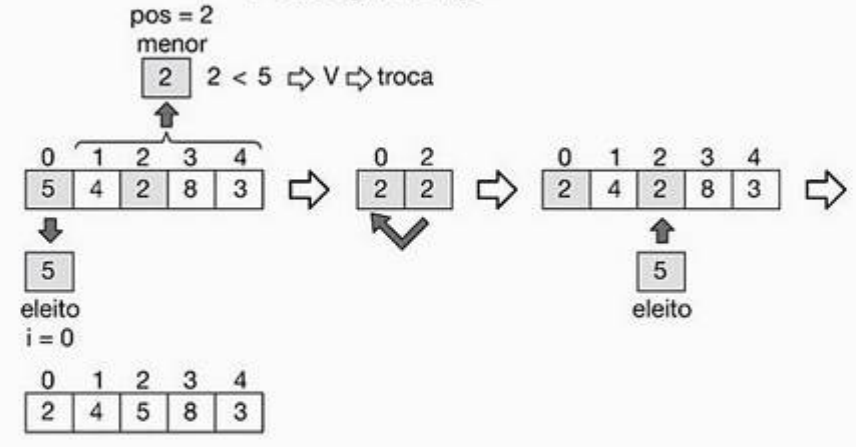

# Selection Sort - Algoritmo de ordenação por selecção

Neste algoritmos de ordenação cada elemento que se encontra no array, apartir da primeira posição, será "eleito" e comparado com o menor ou maior, dependo da ordenação que se pretenda, com os elementos que se estão à sua direita. Quando um elemento satifaz a condição de ordenação, este é trocará a posição com o elemento "eleito", e assim todos os elementos que estão à esquerda do eleito ficam sempre ordenado.


```pseudocode
inicio_algoritmo
declaro X[N],j,i,eleito, menor, pos como valores numericos // N é o numero de elementos de estão armazenados
para i <- 0 até N-1 faz // Isto é um For
inicio
    eleito <- X[i] 
    menor <- X[i+1]
    pos <- i+1
    para j <- i+2 até N-1 faz // Isto é um For
    inicio
        se (X[j] < menor)
        então inicio
            menor <- X[j]
            pos <- j
        fim
    fim
    se (menor < eleito)
    entao inicio
        X[i] <- X[pos]
        X[pos] <- eleito
    fim
fim
fim_algoritmo
```
```.java

import java.util.*;

public class SelectionSort
{

    public static void main(String [] args)
    {
        int [] X = new int[5];
        int indiceDoArray,j, eleito, menor, pos;
        Scanner sc = new Scanner(System.in);
        
        //obter os numeros para introduzir no array/vector
        for(int i=0;i<=4;i++)
        {
            X[i] = sc.nextInt();
        }
            
        // ordenar o array em forma crescente
        // Percorrer desde a primeira posicao à penultima posicao do array
        // elegendo um numero para ser comparado
        for(indiceDoArray=0;indiceDoArray<4;indiceDoArray++)
        {
            eleito = X[indiceDoArray];
            
            // encontrar o menor numero à direita do eleito com a sua posicao
            menor = X[indiceDoArray + 1]
            pos = indiceDoArray + 1;
            
            // Percorrer os elementos que estao a direita do eleito
            // retornando o menor numero a sua direita e a sua posicao
            for(j=indiceDoArray+2 ; j<=4; j++)
            {
                if(X[j] < menor)
                {
                    menor = X[j];
                    pos = j;
                }
            }
                    
            // trocar o numero eleito com o numero da posicao pos
            // o numero da posicao pos e menor numero a direita do eleito
            if(menor < eleito)
            {
                X[indiceDoArray] = X[pos];
                X[pos] = eleito;
            }
        }  
                    
        //Mostrar os elementos do array ordenados em forma crescente
        for(int i = 0; i<=4; i++)
        {
            System.out.println((i+1) + "º numero: " + X[i]);
        }   
    }
}
```

As ilustrações seguintes demonstram a execução do algoritmo **Selection Sort** para uma ordenação crescente de um array com __5__ elementos.

1. **1ª execução do FOR**


1. **2ª execução do FOR**


1. **3ª execução do FOR**


1. **4ª execução do FOR**


