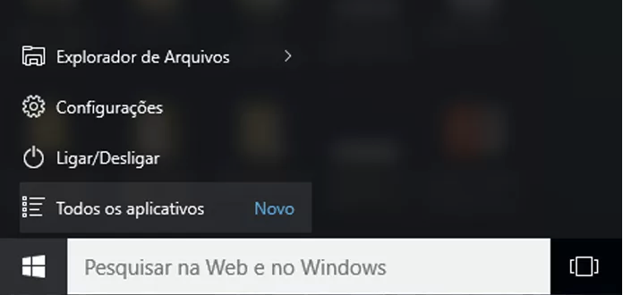

# Introdução ao Java

**Java** é uma linguagem de programação orientada a objetos desenvolvida na década de 90 pela empresa Sun Microsystems. O código criado pela a linguagem Java é compilado para um bytecode que é interpretado por uma máquina virtual (Java Virtual Machine, mais conhecida pela sua abreviação JVM).

Nesta secção irá ser abordado como se "monta" o ambiente de desenvolvimento e como se compila e executa um programa Java.

A documentação sobre a linguagem Java encontra-se dividida nas seguintes secções:

1. [Sintaxe](/java/javasintaxe)
1. [Expressões](/java/javaexpressoes)
1. [Fluxo de Controle](/java/javafluxocontrole)
1. [Input e Output](/java/javaoutputinput)
1. [Arrays](/java/javaArrays)
1. [Exercicios Básicos de Java](/java/javaexerciciosbasicos)

## Estrutura de um código em Java

Como todas as outras linguagens de programação, Java possui um formato básico para a escrita de
códigos. Tal formato é demonstrado abaixo:

```.java

public class NomeDoPrograma
{
    //Duas barras significam comentários
    /*comentários tambem podem seguir o format /**/ */

    //o método main deve sempre estar presente para que o codigo JAVA possa ser executado
    public static void main(String[] args)
    {
        // codigo a ser executado pela a main
    }
}
```

* linhas **1 e 2** : representam comentários. Um comentário pode conter qualquer informação elevante ao comportamento do programa, autor, versão, etc.
* linha **3**: está em branco, pois Java permite linhas em branco entre os comandos.
* linha **4**: é a declaração do "nome do programa", que é case-sensitive (existe diferença
  entre maiúsculas e minúsculas no java). O arquivo que contém o código Java deve ser salvo com
  o mesmo nome que aparece após a declaração **public class** e mais a extensão **.java** (o
  exemplo acima deveria ser salvo como **NomeDoPrograma.java**).
* linha **5 e 9**: a abertura de chave **\{** indica início de bloco.
* linha **8**: essa linha deve aparecer em todos os códigos Java. Quando um programa Java
é executado, o interpretador da JVM executa os comandos que estiverem dentro do
bloco indicado pelo método "static public void main(String)".
* Linha **10**: aqui seria escrito o código propriamente dito.
* Linha **11 e 12**: o fechamento de chave **\}** indica início de bloco.


Exemplo de um programa em Java:  **OlaMundo.java**

```.java 

/**
* Programa - Ola Mundo, Maria
* HAC
* Primeiro programa – escrever uma mensagem "Ola Mundo, Maria" no terminal.
*/
public class OlaMundo
{
    public static void main(String[] args)
    {
        System.out.println("Ola Mundo, Maria");
    }
}

```

## Ambiente de desenvolvimento

Para programar em Java é necessario instalar a maquina virtual do JAVA no pc, para isso é efectuar os seuintes passos:
* Fazer download do JDK do site [Java SDK 10] (https://www.oracle.com/technetwork/java/javase/downloads/jdk10-downloads-4416644.html);
* Seguir os passos de instalação;
* Abrir a consola do windows;
* Insirir o seguinte comando na consola : 

```console
C:\> Java –version
java version "version"
Java(TM) 2 Runtime Environment, Standard Edition (build "build_version")
Java HotSpot(TM) Client VM (build "build_version", mixed mode)
```
Caso não seja pretendido instalar o JDK no pc, pode usar o IDE online para programar java.

* [Java IDE Online](https://repl.it/repls/ExpertHarshUnits)

## Compilação de Programas

### Abrir a Consola de Comandos

#### Pelo o campo de pesquisa do Windows

* Passo 1 -Carrega nas teclas Windows+S para abrires o campo de pesquisa do Windows.

* Passo 2 - Introduz no campo de pesquisa a palavra "cmd" e vai-te aparecer na listagem o programa "Prompt de Comando" ou "Linha de comandos". A imagem mostra o icon do programa. 


* Passo 3 - Por fim, selecciona o programa e ele vai-te abrir a linha de comandos.


#### Opção Todas as aplicações

* Passo 1 - Clica no menu **Iniciar** e depois na opção **Todas as Aplicações**



* Passo 2 - Vai à pasta de **Sistema Do Windows** e clica na opção **Prompt de Comando** ou **Linha de Comando** ou outra que tenha o mesmo icon.


#### Opção da power-shell

Se tiveres dentro da pasta onde tens guardado os teus ficheiro *.java* podes abrir a linha de comandos directamente na pasta.
Para useres essa opção, abre a pasta, mantem a tecla **Shift** do teclado pressionada, clica com o botão direito do rato dentro da pasta e selecciona a opção **Abrir a janela de comando aqui** ou **Abrir a PowerShell**.


A **PowerShell** é igual à linha de comandos.

Neste site [Wiki](https://pt.wikihow.com/Abrir-o-Prompt-de-Comando-no-Windows) mostra mais maneiras de abrires a linha de comandos do windows.

Neste [tutorial](https://medium.com/@adsonrocha/como-abrir-e-navegar-entre-pastas-com-o-prompt-de-comandos-do-windows-10-68750eae8f47) explica como se navega na linha de comandos, como te tinha mostrado na reunião passada.

### Compilar e executar um programa Java no PC

####  Compilar um programa Java

Para compilar o programa **OlaMundo** proceda os seguintes passos: 

1. Cria o ficheiro **OlaMundo.java**.
1. No ficheiro **OlaMundo.java**, escreve a classa _OlaMundo_ apresentada anteriormente e guarda.
1. Abre a consola do Windows.
1. Navega até à pasta onde foi guardado a o ficheiro **OlaMundo.java**.
1. Compila o programa Java, executando o compilador Java passando como parametro o nome do ficheiro do programa.
```console
C:\> cd NomeDaPastaOndeEstaOFicheiro
C:\NomeDaPastaOndeEstaOFicheiro> javac OlaMundo.java
C:\NomeDaPastaOndeEstaOFicheiro>
```
1. Após de se executar o comando _javac_ e o compilador não detectou nenhum erro, então o programa **OlaMundo.java** foi compilado com sucesso.
1. Caso tenha dado algum erro de compilação, é necessario corrigir o programa, guarda-lo e executar o passo **5** novamente. No exemplo embaixo, verifica-se que existe um erro de compilação no programa, falta um **;** no final da linha da codigo _System.out.println("Ola Mundo, Maria")_. Ao introduzi-se esse **;** no final da linha de codigo, gravou-se o programa e executou-se o comando de compilação outra vez e como resultado o programa foi compilado com sucesso.
```console
C:\> cd NomeDaPastaOndeEstaOFicheiro
C:\NomeDaPastaOndeEstaOFicheiro> javac OlaMundo.java
OlaMundo.java:5: error: ';' expected
System.out.println("Ola Mundo, Maria")
^
1 error
C:\NomeDaPastaOndeEstaOFicheiro> javac OlaMundo.java
C:\NomeDaPastaOndeEstaOFicheiro> 
```

## Executar um programa Java

Depois de o processo de compilação do programa ser um sucesso é possivel executar o programa. Para executar o programa é basta executar o comando **_java_** passando como parametro o nome do programa sem extensão **.java**.

```console
C:\> cd NomeDaPastaOndeEstaOFicheiro
C:\NomeDaPastaOndeEstaOFicheiro> java OlaMundo
Ola Mundo, Maria
C:\NomeDaPastaOndeEstaOFicheiro> 
```

### Usar o IDE Java Online


1. Ficheiro onde se encontra o programa.
1. O código do programa.
1. O butão **_run_** tem a funcionadade de compilar e executar o programa.
1. Basicamente é a consola do Windows, onde pode-se observar os resultados do programa ou se ocorrer algum erro de compilação, pode-se observar a mensagem de erro.


